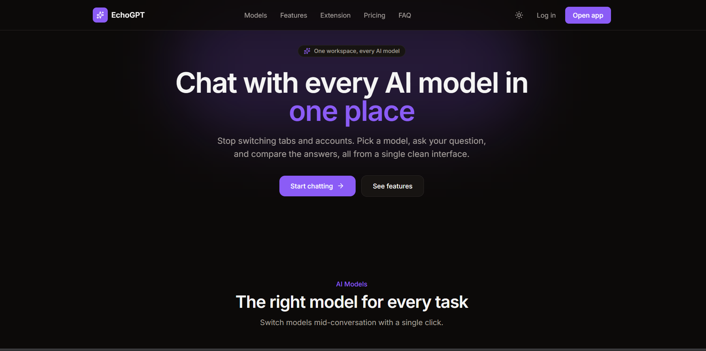
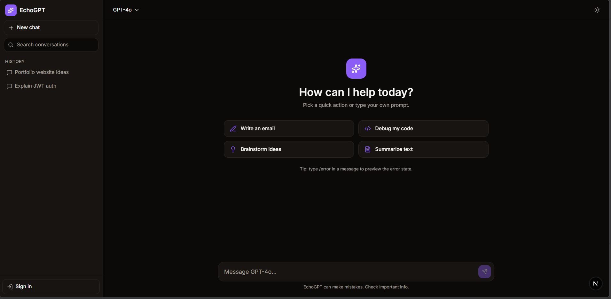
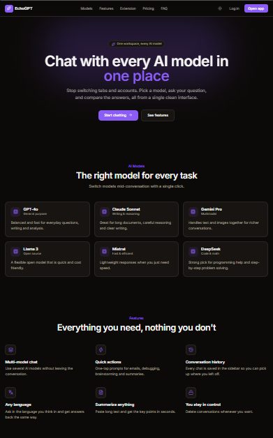
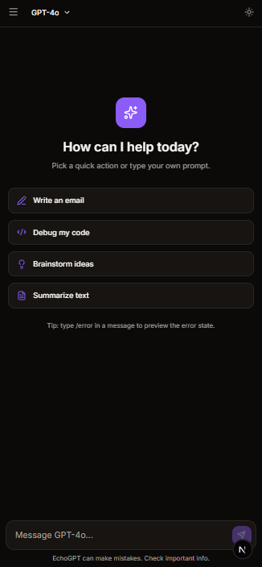
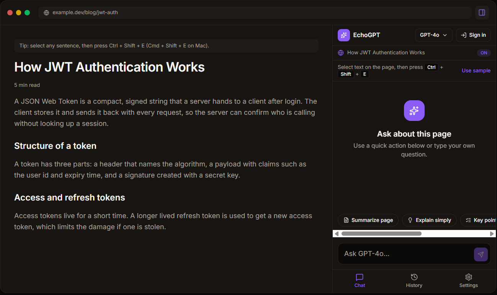
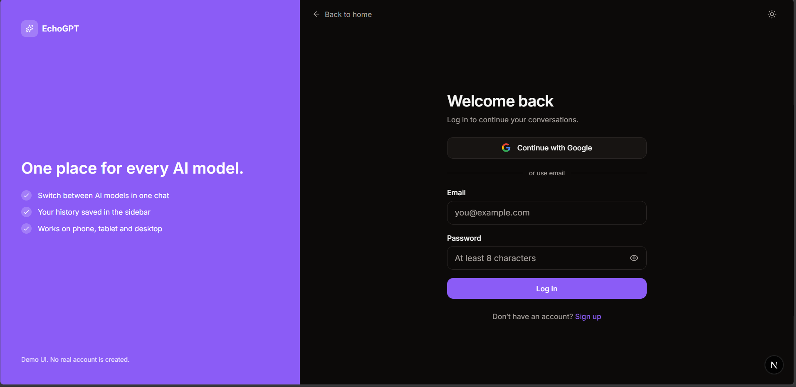
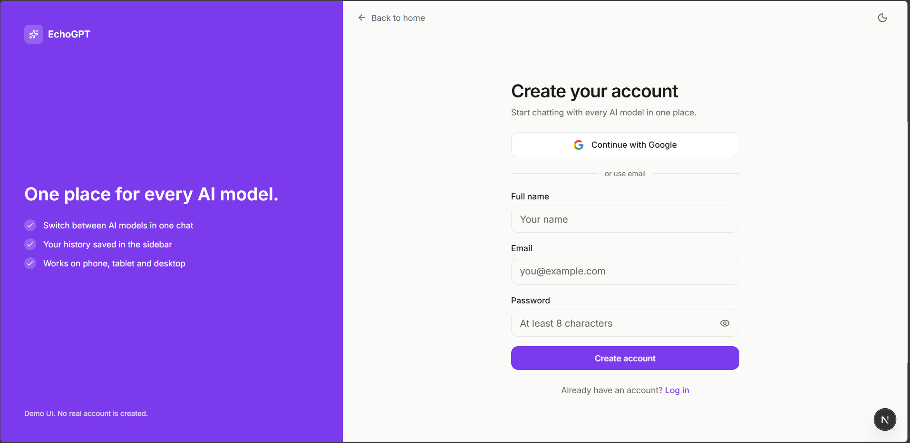
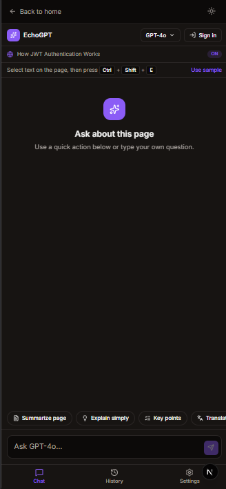

# EchoGPT Redesign

A frontend redesign of the EchoGPT web app, landing page and Chrome extension.
Built as a frontend internship task. There is **no backend**: every AI reply is a placeholder.

**Live demo:** [(https://echogpt-redesign-tau.vercel.app/)]

## Routes

| Route | What it is |
|---|---|
| `/` | Landing page |
| `/chat` | Web app: chat, model selector, history |
| `/extension` | Chrome side panel redesign, shown inside a fake browser |
| `/login`, `/signup` | Auth screens (UI only) |
| `/privacy`, `/support` | Info pages |

## What I built

**Web app**
- Sidebar with conversation history, search and delete
- Model selector, quick actions, auto-resizing prompt box
- Loading skeletons, empty state, no-results state, and an error state with retry
- Light and dark theme, responsive mobile drawer

**Landing page**
- Navbar, hero, AI models, features, product preview, Chrome extension, why EchoGPT, pricing, FAQ, CTA, footer
- "Add to Chrome" button that links to the Chrome Web Store listing

**Chrome extension redesign**
- Side panel layout docked inside a fake browser window (full screen on mobile)
- Chat, model selector, page context toggle, history, settings
- Quick actions: summarize, explain simply, key points, translate, explain selected text
- Selected text detection and a Ctrl/Cmd + Shift + E shortcut demo
- Settings: default model, API endpoint field (never called), privacy note

**Auth UI**
- Log in and sign up with validation and show/hide password
- Account menu with logout

## Design and accessibility notes

- Light and dark themes use CSS variables, so colors stay consistent across every page
- Icon buttons and inputs have labels, focus rings are visible, and Escape closes menus
- Chat updates are announced with live regions, and reduced-motion is respected
- Layouts were checked from 360px to 1440px wide

## Tech stack

Next.js (App Router), TypeScript, Tailwind CSS, lucide-react

## Run locally

```bash
npm install
npm run dev
```

Open http://localhost:3000

Production build:

```bash
npm run build
npm run start
```

## Deployment

Deployed on [Vercel](https://vercel.com) and connected to this GitHub repo.
Every push to `main` triggers an automatic redeploy.

- Framework preset: Next.js (auto detected)
- Build command: `npm run build`
- No environment variables are needed, because the project has no backend

## Screenshots

| Landing | Chat |
|---|---|
|  |  |
|  |  |

| Extension | Login | Signup |
|---|---|---|
|  |  |  |
|  | |

## Limitations

- Frontend only. No real authentication and no real AI requests.
- Demo sign-in and extension settings are stored in `localStorage`.
- Conversations live in memory and reset on refresh.
- Pricing and model descriptions are placeholder content.

## Demo tips

- Type `/error` in a chat message to preview the error state
- On `/extension`, select a sentence on the fake page and press Ctrl/Cmd + Shift + E
- Log in with any valid email and an 8+ character password (no real account is created)